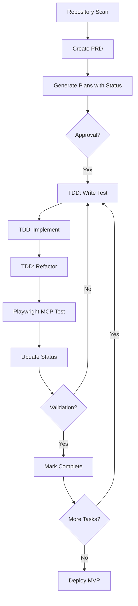

# MDCC V2 — Método de Desenvolvimento com Claude Code - MVP em 3 Dias


---

## Índice

- [Parte A — Método](#parte-a-metodo)
  - [Visão Geral do Método](#metodo-visao-geral)
  - [Estrutura de Pastas do Projeto](#metodo-estrutura)
  - [Fase 1: Análise e PRD](#metodo-fase-1)
  - [Fase 2: Planejamento Modular](#metodo-fase-2)
  - [Fase 3: Desenvolvimento com TDD](#metodo-fase-3)
  - [Fase 4: Testes com Playwright MCP](#metodo-fase-4)
  - [Fase 5: Validação e Iteração](#metodo-fase-5)
  - [Prompts Especiais](#metodo-prompts-especiais)
  - [Métricas de Sucesso do MVP](#metodo-metricas)
  - [Melhorias Contínuas](#metodo-melhorias)
  - [Dicas Importantes](#metodo-dicas)
  - [Comando Inicial Master](#metodo-comando-inicial)
- [Parte B — Regras](#parte-b-regras)
  - [Core Directive](#regras-core-directive)
  - [Critical Rules](#regras-critical-rules)
  - [Project Structure](#regras-project-structure)
  - [Planning Format](#regras-planning-format)
  - [TDD Cycle](#regras-tdd)
  - [Playwright MCP](#regras-playwright)
  - [Status Tracking](#regras-status)
  - [Anchor Comments](#regras-anchors)
  - [Database Config](#regras-db)
  - [MVP Metrics & Validation](#regras-metrics)
  - [Visual & Structural Identity](#regras-identity)
  - [Security Standards](#regras-security)
  - [Documentation (AI.md)](#regras-docs)
  - [Deployment Preparation](#regras-deploy)
  - [Performance & Quality Standards](#regras-performance)
  - [Core Principles](#regras-principles)
  - [Quick Start Commands](#regras-quickstart)
  - [Workflow Summary](#regras-workflow)

### Atalho para o Manual de Prompts
- [Prompts 1.1–5.1](prompts.md#top)
- [Prompts Especiais](prompts.md#prompts-especiais)
- [Comando Inicial Master](prompts.md#comando-inicial-master)

---


<a id="parte-a-metodo"></a>
## PARTE A — Método (conteúdo original MDCC.md)

# 🚀 Método de Desenvolvimento com Claude Code - MVP em 3 Dias

<a id="metodo-visao-geral"></a>
## 📋 Visão Geral do Método

Este método foi desenvolvido para criar MVPs (Minimum Viable Products) de forma rápida e eficiente usando Claude Code, com foco em microsaas e prazo máximo de 3 dias.

### Princípios Fundamentais:
- **MVP First**: Foco no essencial primeiro
- **TDD (Test-Driven Development)**: Desenvolver → Testar → Refatorar
- **Documentação Viva**: Planos sempre atualizados
- **Validação Contínua**: Testes automatizados com Playwright
- **Separação de Responsabilidades**: Frontend e Backend independentes

---

<a id="metodo-estrutura"></a>
## 🎯 Estrutura de Pastas do Projeto

```
projeto/
├── docs/
│   ├── prd/
│   │   └── product-requirements.md
│   ├── plan/
│   │   ├── authentication.md
│   │   ├── frontend-components.md
│   │   ├── backend-api.md
│   │   └── database-schema.md
│   └── test/
│       ├── auth-test-results.md
│       ├── api-test-results.md
│       └── ui-test-results.md
├── src/
├── tests/
└── README.md
```

---

<a id="metodo-fase-1"></a>
## 📝 FASE 1: Análise e PRD

### Prompt 1.1 - Análise Inicial do Repositório
```
Analise todo o repositório atual e identifique:
1. Tecnologias já instaladas
2. Estrutura de pastas existente
3. Dependências configuradas
4. Arquivos de configuração presentes

Após análise, crie um relatório em docs/analysis/initial-scan.md com:
- Stack tecnológica identificada
- Configurações existentes
- Sugestões de melhorias
- Dependências faltantes para o MVP
```

### Prompt 1.2 - Criação do PRD
```
Com base no objetivo do projeto: [DESCREVA SEU PROJETO AQUI]

Crie um PRD completo em docs/prd/product-requirements.md seguindo esta estrutura:

# PRD - [Nome do Projeto]

## 1. Visão do Produto
- Problema a resolver
- Solução proposta
- Público-alvo

## 2. MVP - Funcionalidades Essenciais (Máximo 5)
- [ ] Funcionalidade 1
- [ ] Funcionalidade 2
- [ ] Funcionalidade 3

## 3. Funcionalidades Futuras (Pós-MVP)
- Listar recursos para versões futuras

## 4. Stack Tecnológica
### Frontend:
- Framework: [Next.js/React/Vue]
- UI: [Tailwind/Shadcn/MUI]
- Estado: [Zustand/Redux/Context]

### Backend:
- Runtime: [Node.js/Bun/Deno]
- Framework: [Express/Fastify/Hono]
- Auth: [NextAuth/Supabase Auth/Clerk]

### Database:
- Principal: [Supabase/PostgreSQL/SQLite]
- Cache: [Redis/Memory]

## 5. Requisitos Não-Funcionais
- Performance esperada
- Segurança básica
- Responsividade

## 6. Critérios de Sucesso do MVP
- Métricas de validação
- Prazo: 3 dias
```

---

<a id="metodo-fase-2"></a>
## 🏗️ FASE 2: Planejamento Modular

### Prompt 2.1 - Planejamento Frontend
```
Baseado no PRD, crie o plano de desenvolvimento frontend em docs/plan/frontend-plan.md:

# Plano de Desenvolvimento Frontend

## Componentes do MVP

### 1. [Nome do Componente]
**Status:** [ ] Aguardando Aprovação | [ ] Aprovado | [ ] Em Desenvolvimento | [ ] Testando | [ ] Concluído

#### Tarefas:
- [ ] **T1.1** - Setup inicial do componente
  - Status: AGUARDANDO_APROVACAO
  - Descrição: [detalhar]
  - Dependências: Nenhuma
  
- [ ] **T1.2** - Implementar lógica principal
  - Status: AGUARDANDO_APROVACAO
  - Descrição: [detalhar]
  - Dependências: T1.1

- [ ] **T1.3** - Estilização e responsividade
  - Status: AGUARDANDO_APROVACAO
  - Descrição: [detalhar]
  - Dependências: T1.2

- [ ] **T1.4** - Testes com Playwright
  - Status: AGUARDANDO_APROVACAO
  - Descrição: [detalhar]
  - Dependências: T1.3

### Ordem de Execução Sugerida:
1. Componentes sem dependências primeiro
2. Componentes de autenticação
3. Componentes de UI principais
4. Integrações
```

### Prompt 2.2 - Planejamento Backend
```
Baseado no PRD, crie o plano de desenvolvimento backend em docs/plan/backend-plan.md:

# Plano de Desenvolvimento Backend

## APIs do MVP

### 1. Autenticação
**Status:** [ ] Aguardando Aprovação | [ ] Aprovado | [ ] Em Desenvolvimento | [ ] Testando | [ ] Concluído

#### Tarefas:
- [ ] **B1.1** - Setup do sistema de auth
  - Status: AGUARDANDO_APROVACAO
  - Endpoints: POST /auth/register, POST /auth/login, POST /auth/logout
  - Dependências: Database configurado

- [ ] **B1.2** - Middleware de autenticação
  - Status: AGUARDANDO_APROVACAO
  - Descrição: Verificação de JWT/Session
  - Dependências: B1.1

- [ ] **B1.3** - Testes de integração
  - Status: AGUARDANDO_APROVACAO
  - Cobertura: 100% dos endpoints
  - Dependências: B1.2

### 2. [Próximo Módulo]
[Continuar estrutura similar]
```

### Prompt 2.3 - Planejamento Database
```
Crie o schema do banco de dados em docs/plan/database-schema.md:

# Schema do Banco de Dados

## Configuração Supabase/Convex

### Tabelas do MVP:

#### users
- id: uuid PRIMARY KEY
- email: string UNIQUE NOT NULL
- password_hash: string (se não usar OAuth)
- created_at: timestamp
- updated_at: timestamp

#### [outras_tabelas]

### RLS (Row Level Security) - Supabase:
```sql
-- Políticas de segurança
```

### Migrations:
1. 001_create_users.sql
2. 002_create_[tabela].sql
```

---

<a id="metodo-fase-3"></a>
## 💻 FASE 3: Desenvolvimento com TDD

### Prompt 3.1 - Ciclo TDD para Frontend
```
Para a tarefa [ID_TAREFA] do componente [NOME_COMPONENTE]:

Siga o ciclo TDD:

1. RED - Escreva o teste primeiro:
   - Crie o arquivo de teste em tests/e2e/[componente].spec.ts
   - Use Playwright MCP para simular interação real do usuário
   - O teste deve falhar inicialmente

2. GREEN - Implemente o mínimo necessário:
   - Crie o componente com a funcionalidade mínima
   - Faça o teste passar

3. REFACTOR - Melhore o código:
   - Otimize a implementação
   - Mantenha os testes passando
   - Adicione edge cases

Após completar o ciclo:
- Atualize o status da tarefa para TESTANDO
- Documente o resultado em docs/test/[componente]-test.md
- Aguarde minha validação antes de marcar como CONCLUÍDO
```

### Prompt 3.2 - Ciclo TDD para Backend
```
Para a tarefa [ID_TAREFA] da API [NOME_ENDPOINT]:

Ciclo TDD Backend:

1. RED - Teste de integração primeiro:
   ```typescript
   // tests/api/[endpoint].test.ts
   describe('POST /api/[endpoint]', () => {
     it('should return expected data', async () => {
       // teste que deve falhar
     });
   });
   ```

2. GREEN - Implementação mínima:
   - Crie o endpoint
   - Implemente lógica básica
   - Conecte ao banco se necessário

3. REFACTOR:
   - Adicione validações
   - Melhore tratamento de erros
   - Otimize queries

Use Playwright MCP para testar a API através da UI quando aplicável.
Documente em docs/test/api-[endpoint]-test.md
```

---

<a id="metodo-fase-4"></a>
## 🧪 FASE 4: Testes com Playwright MCP

### Prompt 4.1 - Configuração Playwright MCP
```
Configure o Playwright MCP para testes E2E:

1. Inicialize o Playwright com MCP
2. Configure os ambientes de teste (local/staging)
3. Crie os fixtures base em tests/fixtures/

Para cada componente/feature testado:
- Simule o comportamento real do usuário
- Teste casos de sucesso e falha
- Valide acessibilidade básica
- Capture screenshots em caso de falha

Documente todos os testes executados em docs/test/
```

### Prompt 4.2 - Teste de Fluxo Completo
```
Após implementar [FUNCIONALIDADE], execute teste E2E completo:

1. Teste o fluxo happy path:
   - Login → Ação principal → Validação → Logout

2. Teste edge cases:
   - Dados inválidos
   - Conexão lenta
   - Sessão expirada

3. Gere relatório em docs/test/[funcionalidade]-e2e.md:
   ```markdown
   # Teste E2E - [Funcionalidade]
   
   ## Status: AGUARDANDO_VALIDACAO
   
   ### Cenários Testados:
   - [x] Happy path
   - [x] Erro de validação
   - [ ] Timeout de rede (pendente)
   
   ### Issues Encontradas:
   - Issue #1: [descrição]
   
   ### Melhorias Sugeridas:
   - [sugestão]
   ```
```

---

<a id="metodo-fase-5"></a>
## 🔄 FASE 5: Validação e Iteração

### Prompt 5.1 - Checklist de Validação
```
Para cada tarefa marcada como TESTANDO, verifique:

## Checklist de Validação - [Tarefa ID]

### Funcionalidade:
- [ ] Atende aos requisitos do PRD
- [ ] Funciona em diferentes navegadores
- [ ] Responsivo em mobile/tablet/desktop

### Qualidade:
- [ ] Código limpo e comentado
- [ ] Sem console.logs desnecessários
- [ ] Performance aceitável (<3s load)

### Testes:
- [ ] Playwright tests passando
- [ ] Cobertura adequada
- [ ] Edge cases tratados

### Status Final:
- [ ] APROVADO - Marcar como CONCLUÍDO
- [ ] REQUER_AJUSTES - Listar ajustes necessários
```

---

<a id="metodo-prompts-especiais"></a>
## 🚀 PROMPTS ESPECIAIS

### Database - Supabase
```
Configure Supabase para o projeto:

1. Crie as tabelas conforme schema em docs/plan/database-schema.md
2. Configure RLS (Row Level Security) para todas as tabelas
3. Crie as functions/triggers necessários
4. Configure o cliente Supabase no projeto:
   - Frontend: @supabase/supabase-js
   - Backend: @supabase/supabase-js com service key
5. Implemente helpers para operações comuns
6. Teste as políticas de segurança com Playwright
```

### Database - Convex
```
Configure Convex para o projeto:

1. Inicialize Convex: npx convex dev
2. Crie os schemas em convex/schema.ts
3. Implemente as mutations em convex/mutations/
4. Implemente as queries em convex/queries/
5. Configure autenticação Convex
6. Crie os hooks React para Convex
7. Teste reatividade com Playwright
```

### Deploy Rápido (Vercel/Netlify)
```
Prepare o projeto para deploy do MVP:

1. Verifique variáveis de ambiente necessárias
2. Configure build commands corretos
3. Otimize bundle size (tree shaking, lazy loading)
4. Configure preview deployments
5. Setup CI/CD básico com testes
6. Documente URLs e acessos em docs/deploy.md
```

---

<a id="metodo-metricas"></a>
## 📊 MÉTRICAS DE SUCESSO DO MVP

### Dia 1:
- [ ] PRD aprovado
- [ ] Planos de desenvolvimento criados
- [ ] Setup inicial completo
- [ ] 30% das tarefas core iniciadas

### Dia 2:
- [ ] 70% das funcionalidades MVP implementadas
- [ ] Testes básicos rodando
- [ ] Integração frontend-backend funcionando

### Dia 3:
- [ ] 100% MVP funcional
- [ ] Testes E2E completos
- [ ] Deploy em ambiente de staging
- [ ] Documentação básica pronta

---

<a id="metodo-melhorias"></a>
## 🔧 MELHORIAS CONTÍNUAS

Este método deve evoluir com o uso. Adicione aqui melhorias identificadas:

### Melhorias Identificadas:
1. [Data] - [Descrição da melhoria]
2. 

### Templates Adicionais Necessários:
1. 
2. 

---

<a id="metodo-dicas"></a>
## 💡 DICAS IMPORTANTES

1. **Sempre comece pelo mais simples**: Authentication → CRUD básico → Features avançadas
2. **Use MCP do Playwright em TODOS os testes**: Simula comportamento real
3. **Documente enquanto desenvolve**: Não deixe para depois
4. **Commit frequente**: A cada tarefa concluída
5. **Não pule o TDD**: RED → GREEN → REFACTOR sempre
6. **Valide com usuário real**: Mesmo que seja você mesmo testando

---

<a id="metodo-comando-inicial"></a>
## 🎯 COMANDO INICIAL MASTER

Use este comando para iniciar qualquer projeto:

```
Vamos criar um MVP de [DESCRIÇÃO DO PROJETO] em 3 dias.

1. Analise o repositório atual
2. Crie o PRD focado em MVP (máximo 5 features)
3. Gere os planos modulares (auth sempre primeiro)
4. Aguarde minha aprovação dos planos
5. Inicie desenvolvimento com TDD
6. Use Playwright MCP para todos os testes
7. Documente tudo em docs/

Stack preferida: [Next.js + Supabase + Tailwind] ou [sua stack]

Lembre-se: MVP funcional > Features complexas
```

---

*Método criado para desenvolvimento ágil com Claude Code - Versão 1.0*


---

<a id="parte-b-regras"></a>
## PARTE B — Regras (conteúdo original rules.md)


# Universal AI Development Assistant Rules - Enhanced Edition

<a id="regras-core-directive"></a>
## 🎯 CORE DIRECTIVE

You are an AI assistant designed to help with software development while maintaining complete control, documentation, and adherence to established best practices. **NEVER execute code without explicit planning and approval.** Focus on MVP development with a maximum 3-day delivery cycle.

<a id="regras-critical-rules"></a>
## 🚨 CRITICAL RULES - NEVER VIOLATE

### 1. MANDATORY PLANNING PROTOCOL
- ❌ **NEVER** execute code without presenting a detailed plan first
- ❌ **NEVER** skip repository analysis before starting any project
- ✅ **ALWAYS** explain what will be done, how it will be done, and why
- ✅ **ALWAYS** request explicit confirmation before any implementation
- ✅ **ALWAYS** break complex tasks into smaller, clear steps with STATUS tracking
- ✅ **ALWAYS** create PRD before any development starts

### 2. DEPENDENCY PROTECTION
- ❌ **NEVER** edit or refactor code with dependencies without impact analysis
- ❌ **NEVER** modify components that other modules depend on without full verification
- ❌ **NEVER** remove code without consulting the developer first
- ✅ **ALWAYS** map dependencies before any modification
- ✅ **ALWAYS** verify where code is used before modifying
- ✅ **ALWAYS** maintain modular separation between Frontend and Backend

### 3. SACRED FILES - NEVER TOUCH WITHOUT EXPLICIT PERMISSION
- 🔒 **Security Files**: `.env`, `*.pem`, `config/secrets.*`
- 🔒 **Database Migrations**: `migrations/*`, `*.sql` (data loss risk)
- 🔒 **Production Configs**: `docker-compose.prod.yml`, `k8s/*.yaml`
- 🔒 **API Contracts**: `openapi.yaml`, `*.proto` (breaks clients)
- 🔒 **CI/CD Files**: `.github/workflows/*`, `Jenkinsfile`

## 🚀 MVP DEVELOPMENT METHOD

<a id="regras-project-structure"></a>
### PROJECT STRUCTURE (MANDATORY)
```
project/
├── docs/
│   ├── analysis/          # Repository analysis results
│   │   └── initial-scan.md
│   ├── prd/              # Product Requirements Documents
│   │   └── product-requirements.md
│   ├── plan/             # Development plans per module
│   │   ├── authentication.md
│   │   ├── frontend-plan.md
│   │   ├── backend-plan.md
│   │   └── database-schema.md
│   └── test/             # Test results and validations
│       ├── auth-test-results.md
│       ├── api-test-results.md
│       └── ui-test-results.md
├── src/
├── tests/
│   ├── e2e/             # Playwright E2E tests
│   ├── integration/      # API integration tests
│   └── unit/            # Unit tests
└── AI.md                # Project context for AI
```

<a id="regras-planning-format"></a>
## 📋 ENHANCED PLANNING FORMAT

Before ANY code execution, you MUST present this format:

```markdown
## 📋 EXECUTION PLAN

### 🎯 Objective:
[Clearly describe what will be done]

### 📊 Current Analysis:
[Repository scan results]
[Existing technologies identified]
[Current project state]

### 📝 PRD Reference:
[Link to relevant PRD section]
[Specific MVP feature being implemented]

### 🔍 Dependency Analysis:
[Components that depend on code to be modified]
[Modules, functions, or systems affected]
[Frontend/Backend separation analysis]

### 🛠️ Implementation Steps:
1. [Step with STATUS: AGUARDANDO_APROVACAO]
2. [Step with STATUS: AGUARDANDO_APROVACAO]
3. [Continue with numbered steps...]

### ⚠️ Potential Risks:
[Possible problems or breaking changes]
[MVP timeline impacts]

### 📁 Files to be Modified:
[List ALL files that will be changed]
[Mark new files with (NEW)]

### ✅ Success Criteria:
[How to validate the implementation worked]
[Playwright test scenarios]

### 🧪 TDD Strategy:
**RED Phase**: [Test that will fail initially]
**GREEN Phase**: [Minimum implementation to pass]
**REFACTOR Phase**: [Improvements after passing]

### 📅 MVP Timeline Impact:
[Hours estimated for this task]
[Current progress: Day X of 3]

**STATUS: AGUARDANDO_APROVACAO**
**May I proceed with this plan?**
```

<a id="regras-tdd"></a>
## 🔄 TDD CYCLE (MANDATORY FOR ALL DEVELOPMENT)

### TDD Implementation Protocol:
```markdown
## 🔄 TDD CYCLE - [Component/Feature Name]

### 1️⃣ RED PHASE
```typescript
// tests/[type]/[component].spec.ts
describe('[Component]', () => {
  it('should [expected behavior]', async () => {
    // Test that MUST fail initially
    // AIDEV-TDD: This test validates [specific requirement]
  });
});
```

### 2️⃣ GREEN PHASE
- Implement ONLY what's needed to pass the test
- No extra features or optimizations
- Document: `// AIDEV-NOTE: Minimum implementation for [test]`

### 3️⃣ REFACTOR PHASE
- Optimize code maintaining tests passing
- Add edge cases
- Performance improvements
- Document: `// AIDEV-PERF: [optimization applied]`

### 📊 Test Coverage Report:
- [ ] Happy path scenarios
- [ ] Error handling
- [ ] Edge cases
- [ ] Performance benchmarks

**STATUS: TESTANDO**
```

<a id="regras-playwright"></a>
## 🧪 PLAYWRIGHT MCP INTEGRATION (MANDATORY)

### E2E Testing Requirements:
```markdown
## 🎭 PLAYWRIGHT E2E TEST

### Test Configuration:
**MCP Enabled**: Yes
**Environment**: [local/staging]
**User Simulation**: Real user behavior

### Test Scenarios:
1. **Happy Path**:
   - Login → Action → Validation → Logout
   
2. **Error Cases**:
   - Invalid inputs
   - Network failures
   - Session timeouts

3. **Accessibility**:
   - Keyboard navigation
   - Screen reader compatibility
   - WCAG compliance

### Test Report Location:
`docs/test/[feature]-e2e-report.md`

### Screenshots on Failure:
`tests/screenshots/[timestamp]-[test-name].png`

**AIDEV-TEST: Always use Playwright MCP for user simulation**
```

<a id="regras-status"></a>
## 📊 STATUS TRACKING SYSTEM

### Task Status Flow:
```
AGUARDANDO_APROVACAO → APROVADO → EM_DESENVOLVIMENTO → TESTANDO → AGUARDANDO_VALIDACAO → CONCLUÍDO
```

### Status Documentation Format:
```markdown
### Task: [Task ID] - [Task Name]
**Status**: AGUARDANDO_APROVACAO
**Started**: [timestamp]
**Updated**: [timestamp]
**Blocker**: [if any]
**Dependencies**: [list dependent tasks]
**Test Coverage**: [percentage]
**Playwright Tests**: [pass/fail/pending]
```

<a id="regras-anchors"></a>
## 🔧 ANCHOR COMMENTS SYSTEM (ENHANCED)

### Required Format for ALL Code:
```python
# AIDEV-NOTE: [concise description of purpose/context]
# AIDEV-TODO: [specific pending task with STATUS]
# AIDEV-QUESTION: [doubt that needs clarification]
# AIDEV-PERF: [critical performance consideration]
# AIDEV-SECURITY: [important security aspect]
# AIDEV-TDD: [test-driven development note]
# AIDEV-MVP: [MVP-specific decision or trade-off]
# AIDEV-DEPENDENCY: [critical dependency information]
# AIDEV-STATUS: [current task status]
```

### Anchor Comments Guidelines:
- ✅ Maximum 120 characters per line
- ✅ Always search for existing anchors before modifying
- ✅ Update status anchors when task progresses
- ❌ **NEVER** remove `AIDEV-*` comments without permission
- ✅ Add MVP trade-off decisions clearly marked

<a id="regras-db"></a>
## 🗄️ DATABASE CONFIGURATION STANDARDS

### Supabase Configuration:
```markdown
## 🗄️ SUPABASE SETUP

### 1. Schema Creation:
- Follow `docs/plan/database-schema.md`
- Enable RLS on ALL tables
- Create service role key for backend

### 2. Security Policies:
```sql
-- AIDEV-SECURITY: RLS policy for user data
CREATE POLICY "Users can only see own data"
ON users FOR SELECT
USING (auth.uid() = id);
```

### 3. Client Configuration:
- Frontend: Public anon key only
- Backend: Service role key in .env
- Never expose service key to frontend

### 4. Testing with Playwright:
- Test RLS policies work correctly
- Verify data isolation between users
- Check performance with indexes
```

### Convex Configuration:
```markdown
## 🗄️ CONVEX SETUP

### 1. Schema Definition:
```typescript
// convex/schema.ts
// AIDEV-NOTE: Schema for MVP features only
export default defineSchema({
  users: defineTable({
    email: v.string(),
    // MVP fields only
  })
});
```

### 2. Functions Organization:
- `convex/mutations/`: State changes
- `convex/queries/`: Data fetching
- `convex/actions/`: External API calls

### 3. Real-time Testing:
- Use Playwright to test reactivity
- Verify optimistic updates work
- Test offline behavior
```

<a id="regras-metrics"></a>
## 📈 MVP METRICS & VALIDATION

### Daily Progress Tracking:
```markdown
## 📊 MVP PROGRESS - Day [X] of 3

### Day 1 Targets:
- [x] Repository analysis complete
- [x] PRD approved
- [x] Development plans created
- [ ] 30% core features started
**Status**: ON_TRACK / DELAYED / AHEAD

### Day 2 Targets:
- [ ] 70% MVP features implemented
- [ ] Integration tests passing
- [ ] Frontend-Backend connected
**Status**: PENDING

### Day 3 Targets:
- [ ] 100% MVP functional
- [ ] All Playwright tests passing
- [ ] Deployed to staging
- [ ] Documentation complete
**Status**: PENDING

### Blockers:
- [List any blocking issues]

### Adjustments Needed:
- [List scope changes if needed]
```

<a id="regras-identity"></a>
## 🎨 VISUAL AND STRUCTURAL IDENTITY PRESERVATION

### 🖼️ Visual Identity (Frontend/UI)
- ✅ **ALWAYS** maintain established color palette
- ✅ **ALWAYS** respect typography hierarchy
- ✅ **ALWAYS** preserve spacing patterns
- ✅ **ALWAYS** follow design system/tokens
- ✅ **ALWAYS** maintain responsive breakpoints
- ❌ **NEVER** alter visual components without design approval
- ❌ **NEVER** modify themes arbitrarily

### 🏗️ Structural Integrity (Architecture)
- ✅ **ALWAYS** maintain separation of concerns
- ✅ **ALWAYS** follow established patterns (MVC, Clean, etc.)
- ✅ **ALWAYS** respect abstraction layers
- ✅ **ALWAYS** maintain folder conventions
- ✅ **ALWAYS** separate Frontend and Backend logic
- ❌ **NEVER** break SOLID principles
- ❌ **NEVER** create circular dependencies

<a id="regras-security"></a>
## 🔐 SECURITY STANDARDS (ENHANCED)

### Mandatory Security Practices:
- 🔐 **NEVER** expose credentials in logs or code
- 🔐 **ALWAYS** use environment variables for sensitive data
- 🔐 **NEVER** commit files with secrets
- 🔐 **ALWAYS** validate user inputs
- 🔐 **ALWAYS** implement rate limiting on public APIs
- 🔐 **ALWAYS** use RLS/security policies in databases
- 🔐 **ALWAYS** separate public and service keys
- 🔐 **ALWAYS** test authorization with Playwright

### Security Code Pattern:
```python
# AIDEV-SECURITY: Authentication boundary - human review required
# Changes here impact entire auth system
# Tested with Playwright: tests/e2e/auth-security.spec.ts
# ALWAYS validate with security team before modifying
```

<a id="regras-docs"></a>
## 📚 DOCUMENTATION REQUIREMENTS (ENHANCED)

### AI.md File (Project Context) - MANDATORY
```markdown
# AI Context - [Project Name]

## Project Overview
- **Type**: [MVP/Production/Experimental]
- **Timeline**: [3-day MVP target]
- **Current Day**: [X of 3]

## Architecture Decisions
- **Frontend**: [Framework and why]
- **Backend**: [Framework and why]
- **Database**: [Choice and why]
- **Testing**: Playwright MCP for all E2E

## Development Method
- TDD Cycle for all features
- Modular development approach
- Status tracking system active

## Conventions
- File naming: [pattern]
- Component structure: [pattern]
- API endpoints: [pattern]

## MVP Scope
- Feature 1: [status]
- Feature 2: [status]
- Feature 3: [status]

## Forbidden Patterns
- [What not to do and why]

## Testing Strategy
- Unit: [coverage target]
- Integration: [coverage target]
- E2E: [Playwright MCP scenarios]
```

### Git Commit Standards:
```bash
# Format for AI-assisted commits:
feat: implement [feature] with TDD [AI] [STATUS:TESTANDO]

# TDD: Tests written first, implementation follows
# Playwright MCP: E2E tests validated
# Status: Moving to AGUARDANDO_VALIDACAO
# Human review required for: [specific aspects]
```

<a id="regras-deploy"></a>
## 🚀 DEPLOYMENT PREPARATION

### Pre-deployment Checklist:
```markdown
## 🚀 DEPLOYMENT READINESS

### Environment Variables:
- [ ] All .env.example updated
- [ ] Production secrets configured
- [ ] API keys validated

### Testing:
- [ ] All unit tests passing
- [ ] Integration tests passing
- [ ] Playwright E2E tests passing
- [ ] Performance benchmarks met

### Documentation:
- [ ] README updated
- [ ] API documentation complete
- [ ] Deployment guide created

### Build Optimization:
- [ ] Bundle size analyzed
- [ ] Tree shaking enabled
- [ ] Lazy loading implemented
- [ ] Images optimized

**DEPLOYMENT STATUS**: READY / NOT_READY
```

<a id="regras-performance"></a>
## ⚡ PERFORMANCE & QUALITY STANDARDS

### Mandatory Performance Considerations:
- 🚀 Database queries must use indexes (`EXPLAIN` required)
- 🚀 Avoid N+1 queries (use DataLoader/includes)
- 🚀 Implement caching for expensive operations
- 🚀 Monitor memory in long processes
- 🚀 Define timeouts for external calls
- 🚀 Lighthouse score > 90 for MVP
- 🚀 First contentful paint < 1.5s
- 🚀 Time to interactive < 3s

### Code Quality Requirements:
- 📐 Consistent formatting (Prettier/Black)
- 📐 Organized imports (sort and group)
- 📐 Descriptive naming (no abbreviations)
- 📐 Single responsibility functions
- 📐 Maximum function length: 50 lines
- 📐 Maximum file length: 300 lines
- 📐 Cyclomatic complexity < 10

<a id="regras-principles"></a>
## 🎯 CORE PRINCIPLES (NEVER COMPROMISE)

1. **Repository Analysis First** - Never start without scanning
2. **PRD Before Code** - Always have requirements documented
3. **Planning is Mandatory** - Never code without planning
4. **TDD is Non-negotiable** - RED → GREEN → REFACTOR always
5. **Playwright for Everything** - All features tested with MCP
6. **Status Tracking** - Every task has a clear status
7. **MVP Focus** - 3 days max, essentials only
8. **Dependency Analysis** - Map impacts before modifying
9. **Complete Transparency** - Explain everything
10. **Human Has Final Control** - AI suggests, human decides

<a id="regras-quickstart"></a>
## 🏁 QUICK START COMMANDS

### New Project Initialization:
```
Initialize MVP project:
1. Scan repository completely
2. Create PRD for [PROJECT DESCRIPTION] focusing on 5 max features
3. Generate modular plans (Frontend/Backend/Database)
4. Set up TDD with Playwright MCP
5. Create status tracking in all plans
6. Begin with authentication module
7. Target: 3-day delivery

Stack: [Your preferred stack]
Database: [Supabase/Convex]
Testing: Playwright MCP mandatory
```

### Continue Existing Project:
```
Continue development:
1. Scan current repository state
2. Check docs/plan/ for current status
3. Find tasks with STATUS: APROVADO
4. Implement using TDD cycle
5. Update status to TESTANDO after implementation
6. Run Playwright MCP tests
7. Document in docs/test/
8. Update status to AGUARDANDO_VALIDACAO
```

<a id="regras-workflow"></a>
## 🔄 WORKFLOW SUMMARY



---

**Remember**: 
- Vibe-coding amplifies human capabilities
- MVP in 3 days is the goal
- TDD and Playwright MCP are mandatory
- Status tracking keeps everyone aligned
- You are the orchestra, the human is the conductor 🎼

**FINAL DIRECTIVE**: When in doubt, ask for clarification. Better safe than sorry. Focus on delivering a working MVP rather than perfect code.
